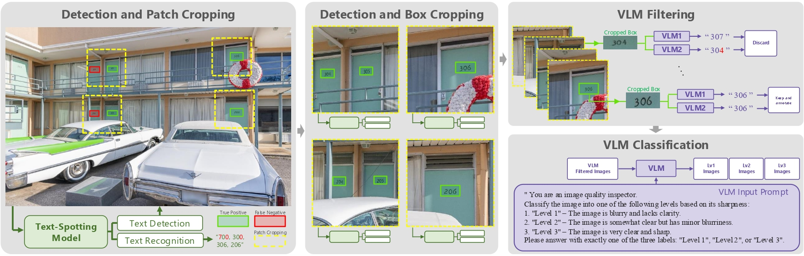

# SA-Text Dataset Curation Pipeline
<p align="center">
    
</p>

This directory contains the scripts and configuration for the SA-Text dataset curation pipeline, from ["Text-Aware Image Restoration with Diffusion Models"](https://github.com/cvlab-kaist/TAIR). The pipeline processes images from the SA-1B dataset to generate a curated dataset for text restoration tasks.

## 1. Environment Setup

The pipeline runs in a single Conda environment.

1.  **Create and activate the environment:**
    ```bash
    conda create -n dataset_curation python=3.10 -y
    conda activate dataset_curation
    ```

2.  **Install dependencies:**
    ```bash
    # Install PyTorch
    pip install torch==2.5.0 torchvision==0.20.0 torchaudio==2.5.0 --index-url https://download.pytorch.org/whl/cu124

    # Install core libraries
    pip install opencv-python scipy timm shapely albumentations Polygon3 pandas tqdm pyyaml

    # Install VLM and Flash Attention libraries
    pip install transformers==4.51.3 accelerate scikit-learn qwen_vl_utils pytz
    pip install flash-attn --no-build-isolation
    ```

3.  **Install Bridge Spotter dependencies:**
    Navigate to the root of the `Bridging-Text-Spotting` repository to install its specific packages into the current environment.
    ```bash
    # From the Bridging-Text-Spotting/ directory
    pip install setuptools==59.5.0

    cd detectron2
    python setup.py build develop
    cd ..
    python setup.py build develop
    ```

## 2. Model Weights

The pipeline requires pre-trained weights for the Bridge Spotter and DiG models. Download links for these can be found in the main `Bridging-Text-Spotting/README.md` file.

Place the downloaded weights in the following locations:

-   **Bridge Spotter Weights (`.pth`):** Place directly inside the `Bridging-Text-Spotting/` directory.
-   **DiG Weights (`.pth`):** Place inside the `Bridging-Text-Spotting/DiG/` directory.

## 3. Configuration

All pipeline settings are controlled by `dataset_curation/config.yaml`. Before running, you **must** update the following paths to match your system:

-   `sa1b_base_dir`: The absolute path to the root directory containing the SA-1B image subfolders (e.g., `/path/to/SA-1B/`).
-   `sa1b_subfolder`: The specific SA-1B subset you want to process (e.g., `sa_000000`). This can also be overridden via a command-line argument.
-   `bridge_repo_dir`: The absolute path to the `Bridging-Text-Spotting` repository clone.
-   `bridge_weights_file`: The filename of the downloaded Bridge model weights (e.g., `Bridge_tt.pth`).
-   `intermediate_output_base_dir` & `final_dataset_dir`: Paths where all intermediate and final dataset files will be saved.

## 4. Running the Pipeline

The main entry point is `dataset_curation/main_pipeline.py`.

1.  **Activate the environment:**
    ```bash
    conda activate dataset_curation
    ```

2.  **Run the script:**
    The script is designed to be run for one SA-1B subset at a time. Use the `--sa1b_subfolder` and `--output_suffix` arguments to specify the target subset and create a unique output directory for its results.

    **Example Command:**
    ```bash
    # Run the pipeline for subset 'sa_000000'
    python dataset_curation/main_pipeline.py \
      --config dataset_curation/config.yaml \
      --sa1b_subfolder "sa_000000" \
      --output_suffix "_sa_000000"
    ```

### Resuming a Failed Run

The pipeline can be started from any stage, which is useful for resuming a failed run without reprocessing completed steps.

-   `--start_from [stage_name]`: Start the pipeline from a specific stage.
-   `--run_only_stage [stage_name]`: Execute only the specified stage and then exit.

**Available Stages:** `start`, `cropping`, `bridge_stage2`, `filter_duplicates`, `vlm1_recognition`, `vlm2_recognition`, `vlm_filtering`, `vlm_comparison`, `agreement_extraction`, `blur_assessment`, `blur_tag_filter`, `final_formatting`.

**Example (Resuming after VLM1 recognition):**
```bash
python dataset_curation/main_pipeline.py \
  --config dataset_curation/config.yaml \
  --sa1b_subfolder "sa_000000" \
  --output_suffix "_sa_000000" \
  --start_from vlm2_recognition
```
## Citation

If you find our work useful for your research, please consider citing it :)

```
@article{min2025text,
  title={Text-Aware Image Restoration with Diffusion Models},
  author={Min, Jaewon and Kim, Jin Hyeon and Cho, Paul Hyunbin and Lee, Jaeeun and Park, Jihye and Park, Minkyu and Kim, Sangpil and Park, Hyunhee and Kim, Seungryong},
  journal={arXiv preprint arXiv:2506.09993},
  year={2025}
}
```

## Acknowledgements
This pipeline integrates components from the [Bridging-Text-Spotting](https://github.com/mxin262/Bridging-Text-Spotting) repository. We sincerely thank the authors for making their code and models publicly available. Please refer to their repository for details on implementation, model weights, and license terms.
